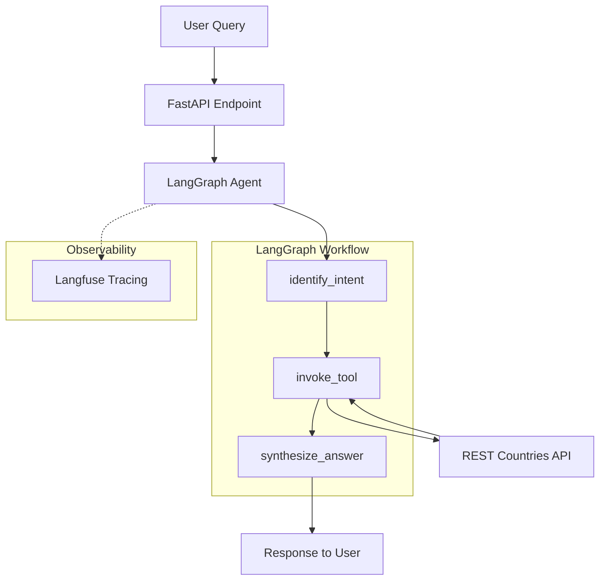
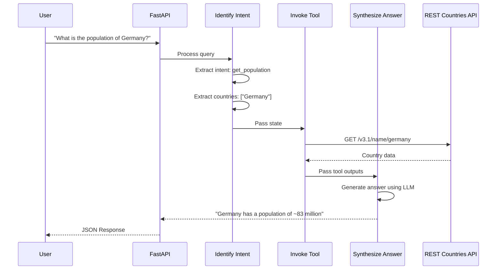

# 🌍 Country Information AI Agent

An intelligent AI agent that answers questions about countries using the REST Countries API and LangGraph.

[](https://www.python.org/)
[](https://langchain-ai.github.io/langgraph/)
[](https://fastapi.tiangolo.com/)

## 🎯 Features

- **Natural Language Queries**: Ask questions like "What is the population of Germany?" or "Compare Japan and France"
- **Multi-turn Conversations**: Maintains context across messages within a session
- **Intelligent Intent Detection**: Uses structured output (Pydantic) for robust intent parsing
- **Production-Ready**: Async I/O, caching, error handling, structured logging, observability

## 🏗️ Architecture



## 🔄 Agent Flow



## 📁 Project Structure

```
country-info-agent/
├── country_info_agent/
│   ├── agent.py              # LangGraph workflow definition
│   ├── api.py                # FastAPI endpoints + Langfuse tracing
│   ├── static/
│   │   └── index.html        # Chat UI
│   └── utils/
│       ├── common.py         # LLM initialization (OpenAI + Gemini fallback)
│       ├── nodes.py          # Graph nodes (intent, tool, synthesis)
│       ├── state.py          # AgentState TypedDict
│       └── tools.py          # REST Countries API tool (cached)
├── langgraph.json            # LangGraph configuration
├── render.yaml               # Render deployment config
├── Dockerfile
├── requirements.txt
└── README.md
```

## 🚀 Quick Start

### Prerequisites

- Python 3.11+
- OpenAI API Key
- (Optional) Google API Key for Gemini fallback
- (Optional) Langfuse keys for observability

### Local Development

```bash
# Clone the repository
git clone https://github.com/BrawlerXull/Country-Info-Agent.git
cd Country-Info-Agent

# Create virtual environment
python -m venv venv
source venv/bin/activate

# Install dependencies
pip install -r requirements.txt

# Configure environment
cp .env.example .env
# Edit .env with your API keys

# Run the server
./run.sh
```

Open **http://localhost:8000** in your browser.

### Docker

```bash
docker build -t country-info-agent .
docker run -p 8000:8000 --env-file .env country-info-agent
```

## 🔧 Environment Variables

| Variable              | Required | Description                   |
| --------------------- | -------- | ----------------------------- |
| `OPENAI_API_KEY`      | ✅       | OpenAI API key                |
| `GOOGLE_API_KEY`      | ❌       | Gemini fallback (recommended) |
| `LANGFUSE_PUBLIC_KEY` | ❌       | Langfuse observability        |
| `LANGFUSE_SECRET_KEY` | ❌       | Langfuse observability        |
| `LANGFUSE_HOST`       | ❌       | Langfuse host URL             |

## 📊 Production Design Decisions

| Feature               | Implementation                        | Rationale                          |
| --------------------- | ------------------------------------- | ---------------------------------- |
| **Async I/O**         | `async/await` + `httpx.AsyncClient`   | Non-blocking for high concurrency  |
| **LLM Fallback**      | OpenAI → Gemini                       | Resilience against API failures    |
| **Structured Output** | Pydantic + `with_structured_output()` | Robust JSON parsing, no regex      |
| **API Caching**       | `@alru_cache(maxsize=128)`            | Reduce API calls, faster responses |
| **Observability**     | Langfuse integration                  | Full trace visibility              |
| **Error Handling**    | Global exception handlers             | Consistent JSON error responses    |
| **Logging**           | Structured logging with timestamps    | Production debugging               |

## 🧪 Example Queries

| Query                                | Intent           | Response                           |
| ------------------------------------ | ---------------- | ---------------------------------- |
| "What is the population of Germany?" | `get_population` | Germany has ~83 million people     |
| "What currency does Japan use?"      | `get_currency`   | Japanese Yen (¥)                   |
| "Compare USA and China population"   | `comparison`     | Detailed comparison                |
| "Hello!"                             | `unknown`        | Friendly greeting with usage guide |
| "What about Narnia?"                 | `general_info`   | Country not found error            |

## ⚠️ Known Limitations

1. **In-Memory Checkpointer**: Uses `MemorySaver` - state is lost on restart. For production, use `PostgresSaver`.
2. **Single Instance**: Horizontal scaling requires distributed checkpointer.
3. **API Rate Limits**: REST Countries API has no auth but may rate-limit.
4. **LLM Dependency**: Requires valid API keys for OpenAI/Gemini.

## 🚢 Deployment

### Render (Recommended)

1. Push to GitHub
2. Connect repo to [Render](https://render.com)
3. Set environment variables in Render dashboard
4. Deploy automatically via `render.yaml`

### Manual Docker Deployment

```bash
docker build -t country-info-agent .
docker run -d -p 8000:8000 \
  -e OPENAI_API_KEY=your_key \
  -e GOOGLE_API_KEY=your_key \
  country-info-agent
```

## 📝 API Reference

### POST /query

```json
{
  "question": "What is the capital of France?",
  "session_id": "optional-session-id"
}
```

**Response:**

```json
{
  "answer": "The capital of France is Paris.",
  "intent": "get_capital",
  "countries": ["France"]
}
```

### GET /health

Returns `{"status": "ok"}` for health checks.

## 📜 License

MIT License

---

Built with ❤️ using [LangGraph](https://langchain-ai.github.io/langgraph/) and [FastAPI](https://fastapi.tiangolo.com/)
